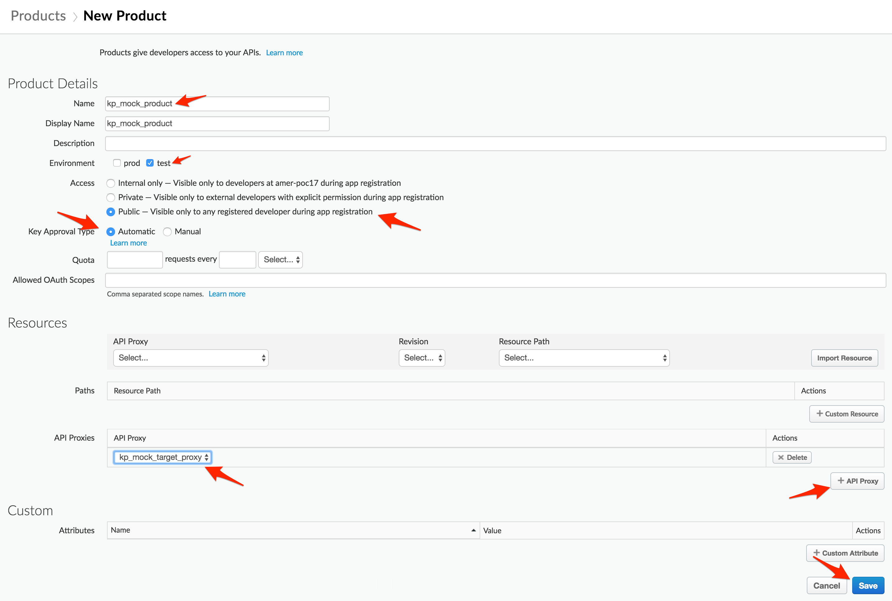
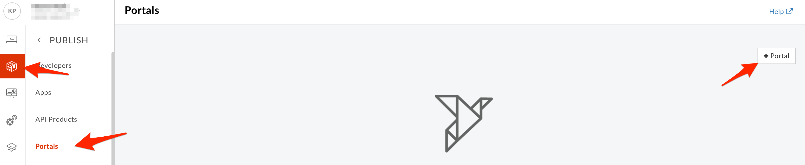
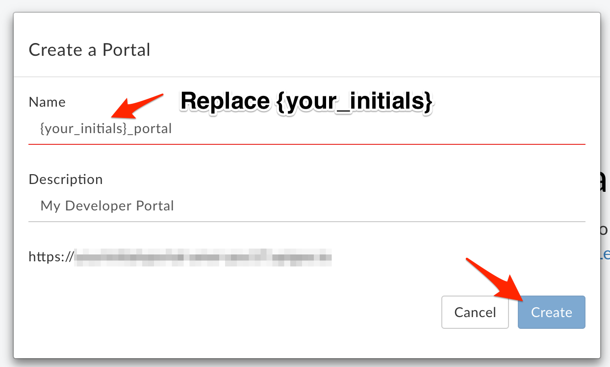
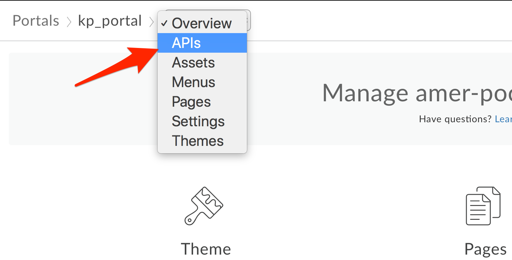
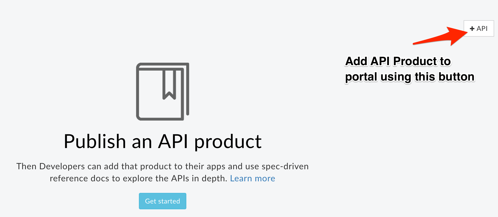
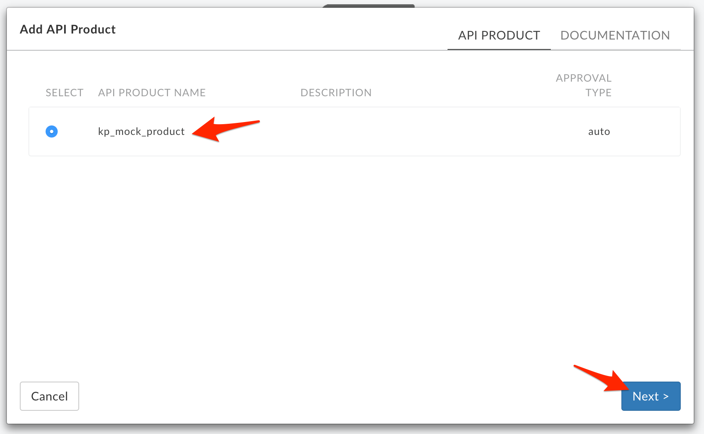
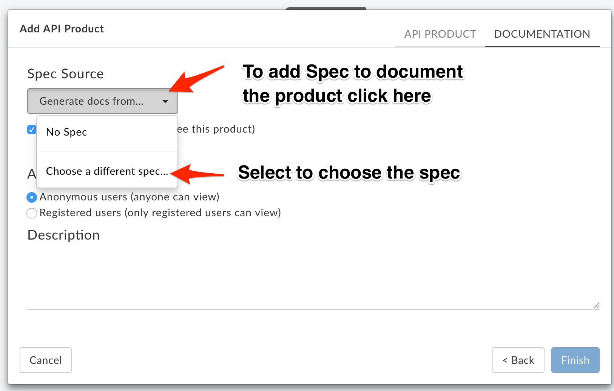
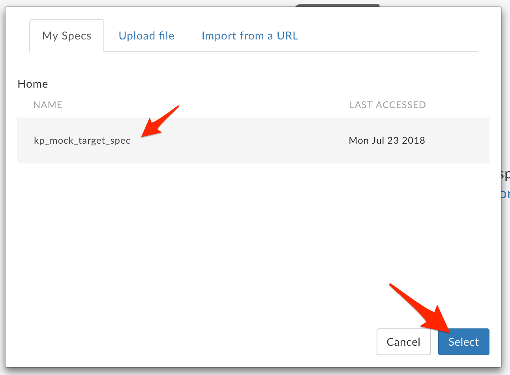
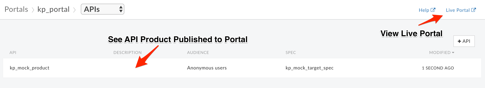

# API Publishing: API Products and Developer Portals

*Duration : 15 mins*

*Persona : API Team*

# Use case

You have an API Proxy that you would like to share with App Developers via a Developer Portal.  You want to enable developers to learn about, register for, and begin using your API Proxy.

# How can Apigee Edge help?

Apigee Edge provides multiple options for your Developer Portal.  There is a lightweight portal that supports branding and customization of much of the site, such as theme, logos, and page content.  The lightweight portal can be published in seconds, directly from the management UI.  We also provide a Drupal-based portal if you want full control and to leverage any of the hundreds of Drupal modules available in the Drupal Market.  This lab focuses on the lightweight Apigee Developer Portal.

In this lab, you will create a Developer Portal and publish an OpenAPI specification that can be used by developers.

# Pre-requisites

For this lab, you will need…

* An OpenAPI specification uploaded to your Organization.  This specification will make up the documentation of your API Proxy.  If you do not have an OpenAPI Specification available for this lab, revisit the lab *API Design : Create a Reverse Proxy from OpenAPI Spec* and then return here to complete these steps.

# Instructions

## Publish API as part of API Product

API Products (which contain API Proxies) are the unit of deployment to the Developer Portal, where App Developers can learn about, register for, and consume your APIs.  Read more about API Products [here](http://docs.apigee.com/developer-services/content/what-api-product).

* Select **Publish → API Products** from the side navigation menu

* Click  **+API Product** and populate the following fields

    * Section: Product Details

        * Name: **{your_initials}**_mock_product

        * Environment: test

        * Access: Public

    * Section: Resources

        * Section: API Proxies

            * Click the **+API Proxy** button

            * Select your Mock Target API Proxy.

* **Save** the API Product.

Note: We are adding the entire API Proxy to the API Product.  We can just as easily select one or more operations from one or more API Proxies and bundle them together in an API Product.

## Publish a new Portal on Apigee Edge

* Select **Publish → Portals → +Portal**

* Enter details in the portal creation wizard. Replace **{your-initials}** with the initials of your name.

  * Name: **{your_initials}**_portal

  * Description: Enter a brief description

* Click **Create Portal**

## Publish an API Product to the Portal

* Click the Portal Editor’s dropdown and select **APIs** from the list of sections

* Click **+API Product** to select an API Product to publish to the Portal

* Select the API Product to publish

* Choose a Snapshot Source.  A Snapshot represents a version of the OpenAPI Specification at a particular point in time.  The Source is the OpenAPI Specification used to generate the Snapshot.  Because the specification might change over time, you take snapshots so that your Portal will reflect the version of the specification that is published, which may differ from the version under current development.  Read [this document](https://docs-new.apigee.com/publish-apis#snapshot-overview) to better understand snapshots.

* Select the OpenAPI Specification from which to create a Snapshot. (NOTE: technically, you should update the "host:" and "path:" variables in your OpenAPI Spec that you created in Lab 1 so they now point to your API proxy hosted on Apigee.  However, for the purposes of this lab, it is also OK to use your existing OpenAPI Spec as is.)

* Select the "Anonymous users" option so anyone can view this API through the portal. Click **Finish** to publish the API product (and OpenAPI Specification Snapshot) to the Developer Portal.

* You should now see your new API Product published to the portal.

* Click the **Live Portal** link to launch a browser tab/window with the new Developer Portal.

* In the Portal UI, click **APIs** to view the products that have been published. For demonstrative purposes, the screenshot includes multiple products. Products are used to bundle APIs together so that a developer can request access to a set of related functionality without registering for each API.  They are also useful for managing access to, and quotas for, particular developers.  For more on API Products, [read this document](http://docs.apigee.com/developer-services/content/what-api-product).

* The Portal will display the OpenAPI Specification (Swagger UI) for browsing the APIs included in the product.  The view below contains two collapsed operations and one expanded to show the details of the operation.  Depending on the method, you’d expect to see model details, response codes, etc., as per the [OpenAPI Specification](https://github.com/OAI/OpenAPI-Specification/blob/master/versions/2.0.md).

# Lab Video

If you would rather watch a video that covers this topic, point your browser [here](https://www.youtube.com/watch?v=_gDpzDJPNQg). (note: instead of using the "Street Carts" sample, use the "Employee API" that you have built in Lab 1).

# Earn Extra-points

Try your hand at managing OpenAPI Snapshots.  Modify your OpenAPI Spec and introduce the new changes to your portal, as a new Snapshot.

Add a second product to the portal and test it by launching the Live Portal.

# Quiz

1. What are two reasons why you might publish multiple API Products to the Developer Portal?

2. Changes made to OpenAPI Specification are made available in the Developer Portal automatically.  True or False?

# Summary

You’ve learned how to do the following;

* Deploy the Apigee Lightweight Developer Portal

* Publish an API Product with an OpenAPI Specification

* Use the Developer Portal UI to browse the OpenApi Specification Snapshot as a developer.

# Rate this lab

How did you link this lab? Rate [here](https://goo.gl/forms/j33WG2U0NFf02QHi1).

Now go to [Lab-4](../Lab%204%20API%20Consumption%20-%20Developers%20and%20Apps)
